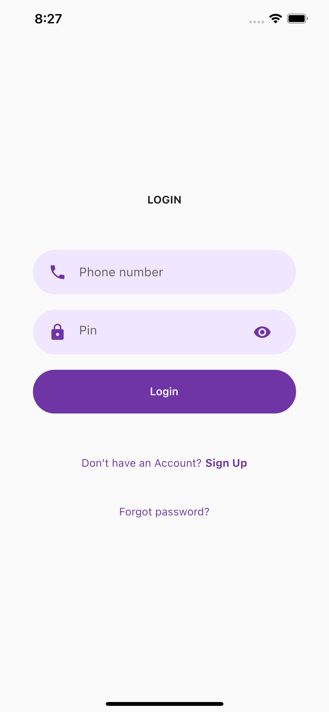
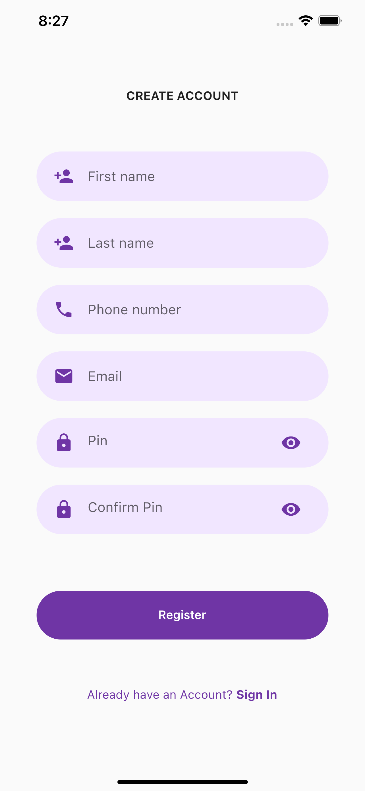

#  [WORK IN PROGRESS]
---
# Money Transfer Mobile App

Money Transfer Hybrid Mobile App using Flutter SDK and Dart programming language

## Tasks
Add the following code in `pubspec.yaml` under `dependencies`
```
# Added HTTP library to make API calls
http: ^0.13.1
```

## Links
Login page design concept taken from `https://www.youtube.com/watch?v=ExKYjqgswJg`  

### Repository
`https://github.com/PracticalSoftwareEngineeringWorkshop/money_transfer_mobile_app`

## Screenshots
Login Screen  
  

Register Screen  
  

## Getting Started

This project is a starting point for a Flutter application.

A few resources to get you started if this is your first Flutter project:

- [Lab: Write your first Flutter app](https://flutter.dev/docs/get-started/codelab)
- [Cookbook: Useful Flutter samples](https://flutter.dev/docs/cookbook)

For help getting started with Flutter, view our
[online documentation](https://flutter.dev/docs), which offers tutorials,
samples, guidance on mobile development, and a full API reference.
